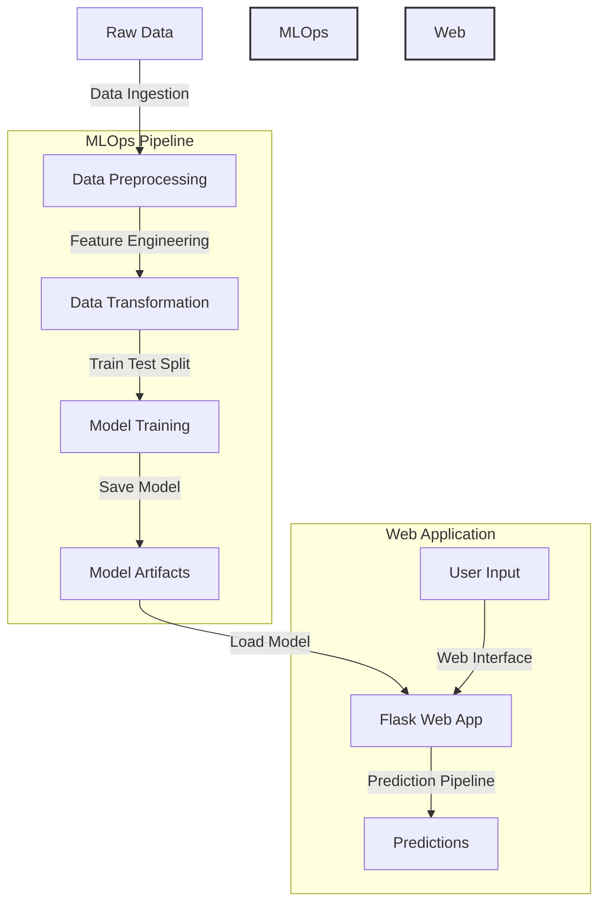
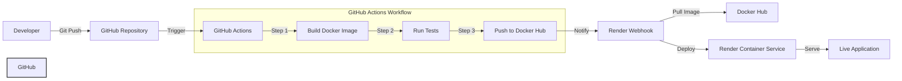

# Student Performance Prediction ML Project

## Project Overview

This end-to-end machine learning project predicts student performance based on various demographic and academic factors. The project implements a complete MLOps pipeline including data processing, model training, API development, containerization, and automated deployment.

## 🏗️ Project Architecture



### Architecture Components Explained:

1. **Data Pipeline**:

   - Raw data ingestion from source
   - Preprocessing and feature engineering
   - Data transformation and standardization
   - Train-test split for model evaluation

2. **MLOps Pipeline**:

   - Model training with multiple algorithms
   - Model evaluation and selection
   - Artifact storage (model.pkl, preprocessor.pkl)
   - Prediction pipeline for inference

3. **Web Application**:
   - Flask-based web interface
   - RESTful API endpoints
   - Real-time prediction service
   - User input validation and processing

## 🌟 Features

- Automated data ingestion and preprocessing
- Model training with multiple algorithms
- Interactive web interface for predictions
- Containerized application for consistent deployment
- Automated CI/CD pipeline with GitHub Actions
- Continuous deployment to Render

## 🛠️ Tech Stack

- **Python** - Primary programming language
- **Scikit-learn** - Machine learning library
- **CatBoost & XGBoost** - Gradient boosting frameworks
- **Flask** - Web application framework
- **Docker** - Containerization
- **GitHub Actions** - CI/CD pipeline
- **Render** - Cloud deployment platform
- **Docker Hub** - Container registry

## 📁 Project Structure

```
├── artifacts/               # Trained models and data files
├── notebook/               # Jupyter notebooks for EDA and model development
│   ├── data/
│   └── EDA & Model Training notebooks
├── src/                    # Source code
│   ├── components/         # Core ML components
│   │   ├── data_ingestion.py
│   │   ├── data_transformation.py
│   │   └── model_trainer.py
│   ├── pipelines/         # Training and prediction pipelines
│   └── utils.py           # Utility functions
├── templates/             # HTML templates for web interface
├── application.py         # Flask application
├── Dockerfile            # Container configuration
├── requirements.txt      # Python dependencies
└── setup.py             # Project setup configuration
```

## �� CI/CD Pipeline



### CI/CD Workflow Explained:

1. **Development Phase**:

   - Developer makes code changes
   - Commits and pushes to GitHub repository
   - GitHub Actions workflow is triggered automatically

2. **GitHub Actions Workflow**:

   - Automated pipeline triggered on push to main branch
   - Builds Docker image with latest code
   - Runs automated tests to ensure quality
   - Pushes successful build to Docker Hub registry

3. **Deployment Phase**:

   - Render webhook is notified of new image
   - Pulls latest image from Docker Hub
   - Deploys new container with zero downtime
   - Monitors deployment health

4. **Continuous Monitoring**:
   - Application health checks
   - Performance monitoring
   - Error logging and tracking
   - Automated rollback if needed

### Key Benefits:

- **Automation**: Zero manual intervention needed
- **Reliability**: Consistent testing and deployment
- **Speed**: Rapid deployment of changes
- **Rollback**: Easy version control and rollback
- **Monitoring**: Continuous health checks

## 🔧 Setup & Installation

### Local Development

1. Clone the repository

```bash
git clone https://github.com/yourusername/student-performance-prediction.git
cd student-performance-prediction
```

2. Create and activate virtual environment

```bash
python -m venv venv
source venv/bin/activate  # Linux/Mac
.\venv\Scripts\activate   # Windows
```

3. Install dependencies

```bash
pip install -r requirements.txt
```

4. Run the application

```bash
python application.py
```

### Docker Deployment

1. Build the Docker image

```bash
docker build -t student-performance-app .
```

2. Run the container

```bash
docker run -p 5000:5000 student-performance-app
```

## 📊 Model Performance

- The model achieves X% accuracy on the test set
- Key features: reading_score, writing_score, parental_education
- Detailed performance metrics available in the training notebooks

## 🌐 API Reference

### Prediction Endpoint

- **URL**: `/predictdata`
- **Method**: `POST`
- **Input Fields**:
  - gender
  - race_ethnicity
  - parental_level_of_education
  - lunch
  - test_preparation_course
  - reading_score
  - writing_score

## 👥 Contributing

Contributions are welcome! Please feel free to submit a Pull Request.

## 📝 License

This project is licensed under the MIT License - see the LICENSE file for details.

## 📧 Contact

- Author: MeetInCode
- Email: mehtameet115@gmail.com
- Project Link: [GitHub Repository](https://github.com/yourusername/student-performance-prediction)
