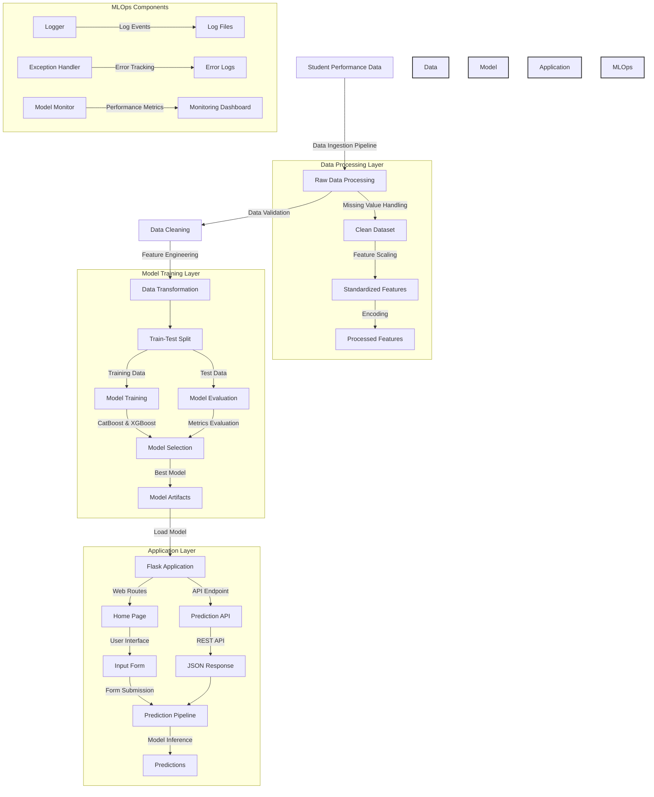

## Project Overview

This end-to-end machine learning project predicts student performance based on various demographic and academic factors. The project implements a complete MLOps pipeline including data processing, model training, API development, containerization, and automated deployment.

## 🏗️ Detailed Project Architecture



### Detailed Architecture Components:

1. **Data Processing Layer**:

   - Raw data ingestion from student performance dataset
   - Automated data validation and cleaning
   - Feature scaling and standardization
   - Categorical variable encoding
   - Missing value handling and outlier detection

2. **Model Training Layer**:

   - Automated train-test split with stratification
   - Multiple model training (CatBoost, XGBoost)
   - Hyperparameter optimization
   - Model evaluation and selection
   - Model artifact generation and storage

3. **Application Layer**:

   - Flask web application with responsive UI
   - RESTful API endpoints for predictions
   - Form-based user input collection
   - Real-time prediction pipeline
   - Result visualization and display

4. **MLOps Components**:
   - Comprehensive logging system
   - Custom exception handling
   - Performance monitoring
   - Model versioning
   - Automated testing

## 🌟 Features

- Automated data ingestion and preprocessing
- Model training with multiple algorithms
- Interactive web interface for predictions
- Containerized application for consistent deployment
- Automated CI/CD pipeline with GitHub Actions
- Continuous deployment to Render

## 🛠️ Tech Stack

- **Python** - Primary programming language
- **Scikit-learn** - Machine learning library
- **CatBoost & XGBoost** - Gradient boosting frameworks
- **Flask** - Web application framework
- **Docker** - Containerization
- **GitHub Actions** - CI/CD pipeline
- **Render** - Cloud deployment platform
- **Docker Hub** - Container registry

## 📁 Project Structure

```
├── artifacts/               # Trained models and data files
├── notebook/               # Jupyter notebooks for EDA and model development
│   ├── data/
│   └── EDA & Model Training notebooks
├── src/                    # Source code
│   ├── components/         # Core ML components
│   │   ├── data_ingestion.py
│   │   ├── data_transformation.py
│   │   └── model_trainer.py
│   ├── pipelines/         # Training and prediction pipelines
│   └── utils.py           # Utility functions
├── templates/             # HTML templates for web interface
├── application.py         # Flask application
├── Dockerfile            # Container configuration
├── requirements.txt      # Python dependencies
└── setup.py             # Project setup configuration
```

## 🚀 Detailed CI/CD Pipeline

```mermaid
graph TD
    A[Developer] -->|"1. Git Push"| B[GitHub Repository]

    subgraph "Stage 1: Continuous Integration (GitHub Actions)"
        B -->|"2. Trigger Workflow"| C["Initialize & Checkout Code"]
        C -->|"3. Setup Environment"| D[Install Dependencies]
        D -->|"4. Run Tests"| E[Tests Pass]
    end

    subgraph "Stage 2: Build and Push Docker Image (GitHub Actions)"
        E -->|"5. Build Success"| F[Build Docker Image]
        F -->|"6. Tag Image"| G[Login to Docker Hub]
        G -->|"7. Push Image"| H[Push to Docker Hub Registry]
    end

    subgraph "Stage 3: Deployment (Render)"
        H -->|"8. Image Ready"| I[Trigger Render Webhook]
        I -->|"9. Pull Latest Image"| J[Initialize Deployment]
        J -->|"10. Start New Container"| K[Run Health Checks]
        K -->|"11. Checks Pass"| L["Route Traffic (Zero-Downtime Switch)"]
    end

    subgraph "Stage 4: Monitoring & Rollback"
        L -->|"12. Verify Deployment"| M[Monitor Application]
        M -->|"13. Check Metrics"| N{Performance Status}
        N -->|"14a. Issues Detected"| O[Initiate Automatic Rollback]
        O -->|"15. Revert to Stable"| P[Previous Healthy Version]
        N -->|"14b. All Clear"| Q[Deployment Successful]
    end

    %% Styling
    style "Stage 1: Continuous Integration (GitHub Actions)" fill:#e6f3ff,stroke:#333,stroke-width:2px
    style "Stage 2: Build and Push Docker Image (GitHub Actions)" fill:#e6ffe6,stroke:#333,stroke-width:2px
    style "Stage 3: Deployment (Render)" fill:#ffe6e6,stroke:#333,stroke-width:2px
    style "Stage 4: Monitoring & Rollback" fill:#fff5e6,stroke:#333,stroke-width:2px


```

### Detailed CI/CD Workflow:

1. **Development Stage**:

   - Code changes pushed to GitHub repository
   - Automated workflow trigger on main branch
   - Environment setup and dependency installation

2. **Continuous Integration**:

   - Automated code checkout
   - Python environment setup
   - Installation of project dependencies
   - Execution of test suite
   - Code quality checks

3. **Docker Build Process**:

   - Multi-stage Docker build
   - Optimized container creation
   - Image tagging with version
   - Secure Docker Hub authentication
   - Image push to registry

4. **Render Deployment**:

   - Webhook-triggered deployment
   - Automated image pulling
   - Container initialization
   - Health check verification
   - Zero-downtime deployment strategy

5. **Monitoring & Maintenance**:
   - Continuous application monitoring
   - Performance metrics tracking
   - Automated rollback capability
   - Version control management
   - Health status verification

### Security Measures:

- Secure environment variables
- Docker Hub authentication
- Protected deployment hooks
- Automated vulnerability scanning

### Rollback Strategy:

- Automated failure detection
- Immediate rollback trigger
- Previous version restoration
- Zero-downtime version switching

## 🔧 Setup & Installation

### Local Development

1. Clone the repository

```bash
git clone https://github.com/yourusername/student-performance-prediction.git
cd student-performance-prediction
```

2. Create and activate virtual environment

```bash
python -m venv venv
source venv/bin/activate  # Linux/Mac
.\venv\Scripts\activate   # Windows
```

3. Install dependencies

```bash
pip install -r requirements.txt
```

4. Run the application

```bash
python application.py
```

### Docker Deployment

1. Build the Docker image

```bash
docker build -t student-performance-app .
```

2. Run the container

```bash
docker run -p 5000:5000 student-performance-app
```


## 🌐 API Reference

### Prediction Endpoint

- **URL**: `/predictdata`
- **Method**: `POST`
- **Input Fields**:
  - gender
  - race_ethnicity
  - parental_level_of_education
  - lunch
  - test_preparation_course
  - reading_score
  - writing_score


## 📧 Contact

- Author: MeetInCode
- Email: mehtameet115@gmail.com


## 🐳 Docker Hub

You can also find the pre-built Docker image for this project on Docker Hub:

[https://hub.docker.com/r/thisismeet/end_to_end_mlproject](https://hub.docker.com/r/thisismeet/end_to_end_mlproject)

To pull and run the image directly, follow these steps:

1. Pull the image from Docker Hub:
   ```bash
   docker pull thisismeet/end_to_end_mlproject:latest
   ```

2. Run the container:
   ```bash
    docker run -p 5000:5000 -e PORT=5000 thisismeet/end_to_end_mlproject:latest
   ```

This will start the application and make it accessible at `http://localhost:5000`.


